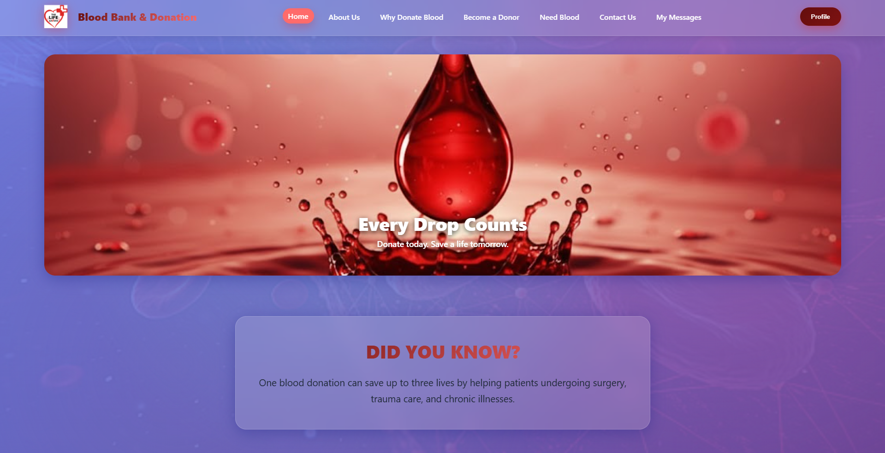
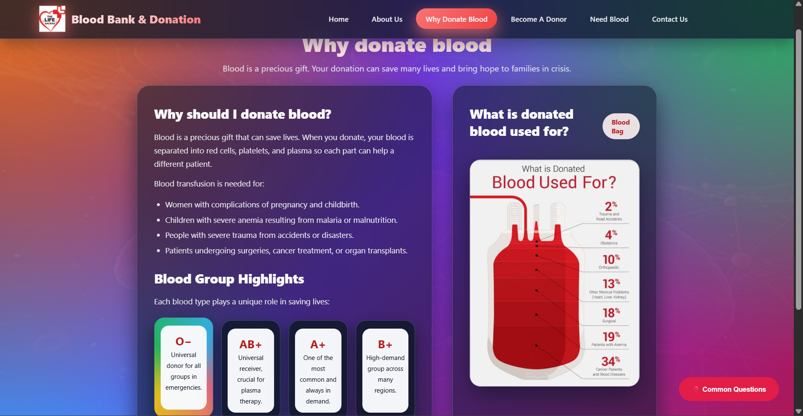
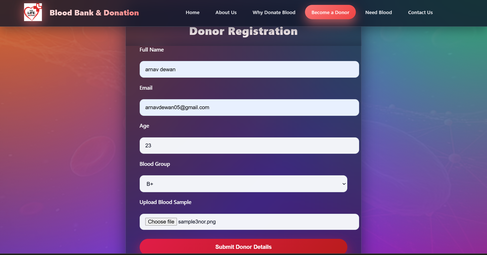
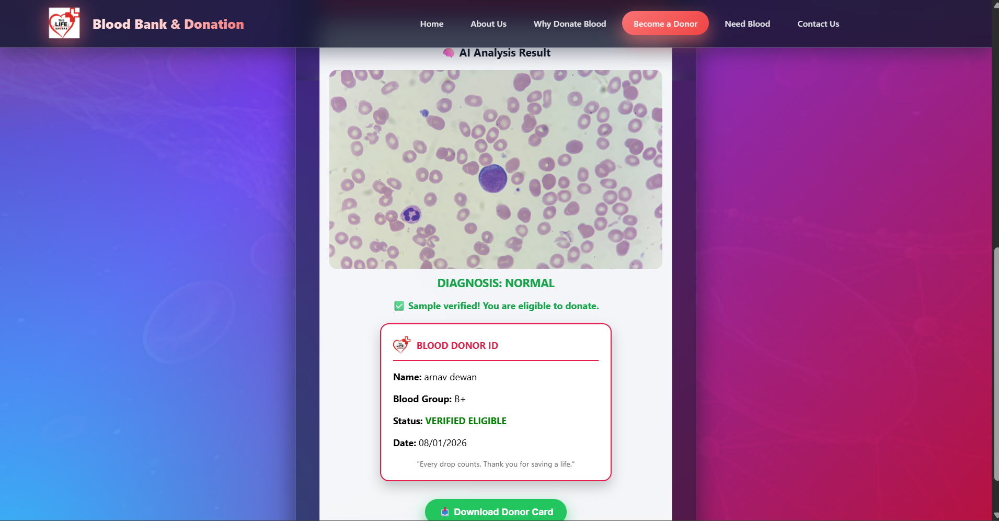
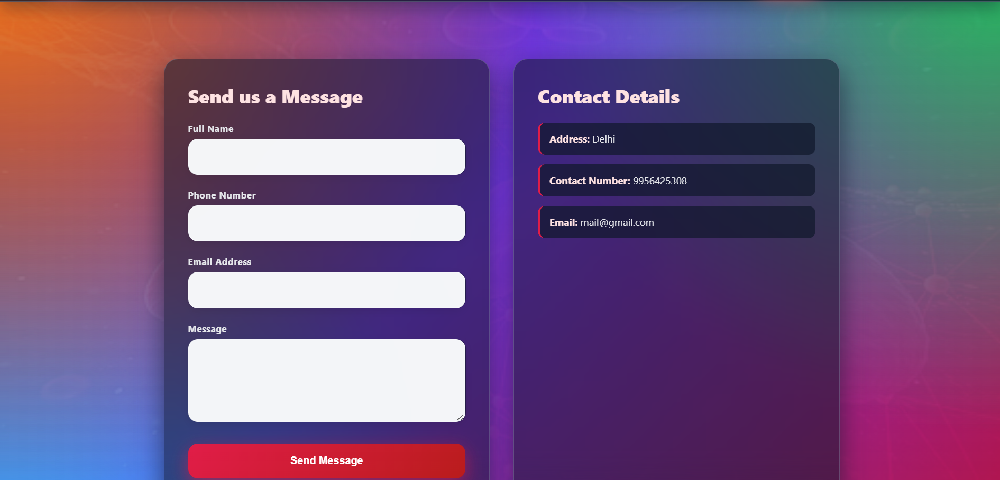
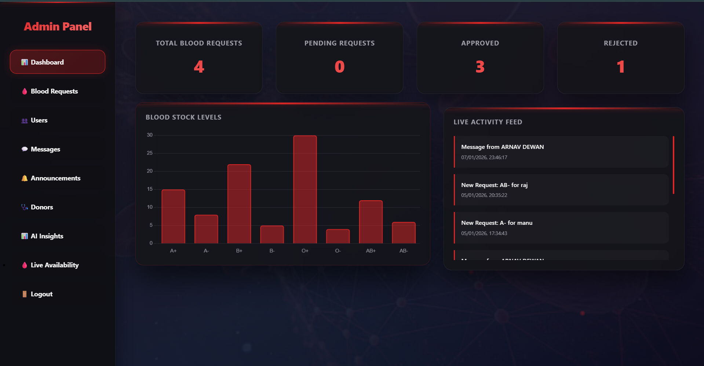
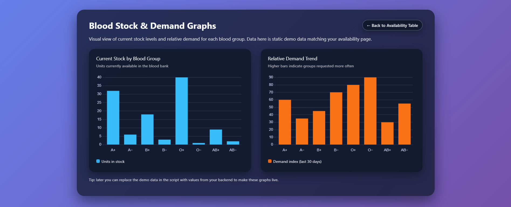

🩸 Blood Connect

A full-stack Blood Bank Management System with AI-based blood sample analysis, donor & recipient management, and a powerful Admin Dashboard.

Built using HTML, CSS, JavaScript, Node.js, Express, MongoDB, and Python (AI model).

🚀 Features
👤 User / Donor Side

Donor registration with:

Full Name

Email

Age

Blood Group

Blood sample image upload

🧠 AI-powered blood sample analysis

Detects whether blood is Normal / Infected

Displays confidence score

✅ Donor details are submitted only if AI result is Normal

🩸 Blood request form for recipients

💬 Contact & message submission

🎨 Responsive modern UI (Glassmorphism design)

🧠 AI Integration

Blood image uploaded from frontend

Image sent to backend using Multer

Python AI model (predict.py) analyzes the blood sample

Backend returns AI response:

{
  "result": "normal",
  "confidence": 0.87,
  "imagePath": "uploads/filename.jpg"
}

⚡ AI result is shown instantly on the same page without reload

🔐 Admin Dashboard

Secure admin-only access

📊 Dashboard statistics:

Total blood requests

Pending requests

Approved requests

Rejected requests

🛠️ Admin can manage:

🩸 Blood requests (Approve / Reject)

👥 Users

🩺 Donors (only AI-normal donors are visible)

💬 User messages (Reply)

🔔 Announcements (Urgent / Normal)

🔄 Live donor and request data fetched from MongoDB

📑 Fully dynamic sidebar navigation

🏗️ Tech Stack
Frontend

HTML5

CSS3 (Glassmorphism UI)

Vanilla JavaScript (Fetch API)

Backend

Node.js

Express.js

MongoDB (Mongoose)

Multer (Image upload)

CORS

AI / Machine Learning

Python

TensorFlow / Keras (Blood analysis model)

child_process.execFile for AI execution

 📸 Screenshots

### 🧾 Login 

### 🧾 user

### 🧾 About us

### 🧾 why-donate 

### 🧾 donorform 

### 🧾 ai result

### 🧾 contact 

### 🧑‍💼 Admin Dashboard

📂 Project Structure
bloodbankmanagementsystem/
│
├── backend/
│   ├── server.js
│   ├── uploads/
│   ├── routes/
│   │   ├── auth.js
│   │   ├── donors.js
│   │   ├── analyze.js
│   │   ├── bloodRequest.js
│   │   ├── messages.js
│   │   ├── users.js
│   │   └── announcements.js
│   └── models/
│       └── Donor.js
│
├── frontend/
│   ├── index.html
│   ├── donate.html
│   ├── need-blood.html
│   ├── admin-dashboard.html
│   ├── css/
│   └── assets/
│
├── ai-model/
│   └── predict.py
│
└── README.md

⚙️ Installation & Setup
1️⃣ Clone Repository
git clone https://github.com/your-username/blood-bank-system.git
cd bloodbankmanagementsystem

2️⃣ Backend Setup
cd backend
npm install
node server.js

Server runs at:

http://localhost:3000

3️⃣ MongoDB

Ensure MongoDB is running locally:

mongodb://127.0.0.1:27017/bloodbank

4️⃣ AI Model Setup

Install required Python dependencies

Ensure python command is available in system PATH

Place trained AI model inside:

ai-model/

5️⃣ Access Frontend

Open in browser:

http://localhost:3000/donate.html

⚠️ Important:
❌ Do NOT open the frontend using VS Code Live Server
✅ Always access through the Express server

⚠️ Known Issue (Resolved)
❌ Problem

Using VS Code Live Server caused:

Page refresh on image upload

AI result not displayed

✅ Solution

Serve frontend using Express:

app.use(express.static("frontend"));

Access pages via:

http://localhost:3000/donate.html

📊 Donor Filtering Logic

Only donors with:

ai_result === "normal"

Are displayed in Admin → Donors section

🔒 Security

Admin access restricted using role-based check

AI analysis runs strictly on the server

No direct database access from frontend

🌟 Future Enhancements

🚀 Deployment (Render / Railway)

🔐 JWT Authentication

🧠 AI retraining dashboard

📈 Blood availability analytics

📧 Email notifications

👨‍💻 Author

Arnav Dewan

